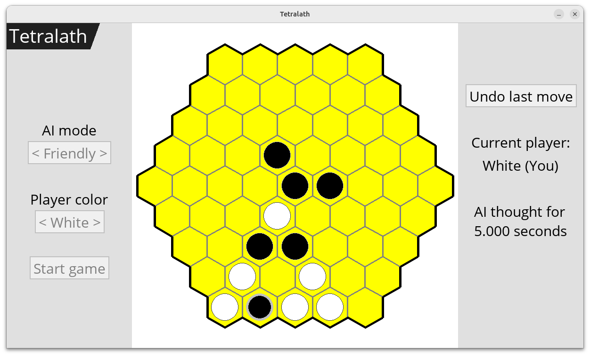
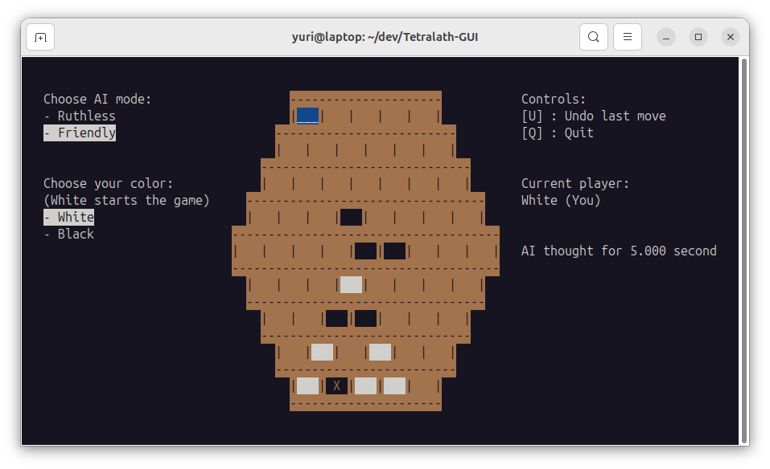

# Tetralath AI

Tetralath is a two-player turn-based board game played on a hexagonal board of 61 positions. This project lets you play against an AI that uses minimax search with alpha-beta pruning and iterative deepening. You can run it as a graphical (GUI) application - the recommended way - or as a terminal (TUI) application.

---

## How to play

- **Pieces:** Two colors, white and black. You choose your color. the AI uses the other.
- **Turns:** Players alternate every turn. On your turn, you place one piece of your color on any empty cell.
- **Start:** White always make the first move to start the game.
- **Winning:** You win by forming a line of 4 pieces of your color (horizontal or along a diagonal).
- **Losing:** If you form a line of 3 pieces of your color without also having a line of 4, you lose (your opponent wins).
- **Summary:** 4-in-a-row wins. 3-in-a-row alone loses.
- **Draw:** If all 61 positions are filled and neither player has won or lost, the game is a tie.

---

## How to run

### Graphical version (GUI) - recommended

From the project root:

```shell
$ sudo apt update
$ sudo apt install -y build-essential python3-dev python3-pip python3-venv
$ chmod +x ./run_frontend.sh
$ ./run_frontend.sh
```

This script builds the shared library in `backend/` (`libtetralath.so`), sets up a Python virtual environment in `frontend/.venv`, installs dependencies from `frontend/requirements.txt`, and runs the GUI. The game engine and AI run in the shared library.



### Terminal version (TUI)

From the project root:

```shell
$ sudo apt update
$ sudo apt install build-essential libncurses-dev
$ chmod +x ./run_backend.sh
$ ./run_backend.sh
```

This builds the standalone application and runs the TUI.



---

## Why 2 languages?

- **C:** In a project with no security concerns, C's low-level nature makes it the obvious choice for eeking out every bit of performance from the AI. At first, it was a standalone application with the game engine and the terminal (TUI) interface tightly coupled. It was later refactored to decouple those components and expose a headless game engine via shared library. Makes use of pthreads for multi-threading and ncurses for the TUI.
- **Python:** Python's ease-of-use, code legibility and plethora of libraries make it a good choice for implementing a graphical interface that only manages simple interactive logic and integrates well with the headless game engine for everything else. Makes use of pygame-ce and pygame-menu-ce for the GUI.

---

## AI behaviour

- **Friendly mode:** The AI tries to win as soon as it can and to delay losing as much as possible. Generally easier for a human to beat.
- **Ruthless mode:** The AI only cares about winning, without optimizing for the earliest win. This makes it perform better and also harder for a human to beat.

The AI uses minimax with alpha-beta pruning with iterative deepening. It has a 5-second limit per move. It searches at depth 1, then 2, then 3, and so on until time runs out. Only fully completed search depths are used. Any run still in progress when the limit is hit is discarded, so no result from beyond the time window is ever used. With multi-threading enabled (default), two threads share the work (e.g. one does odd depths, one even depths) to use the 5 seconds more effectively.

---

## Undo

Both versions (GUI and TUI) let you undo moves: one undo typically removes your last move and the AI's reply. Full move history is kept, so you can undo repeatedly back to the start of the game.

---

## Project layout

- **`backend/`** - C game engine and AI. Can build the standalone application or the shared library `libtetralath.so` used by the GUI.
- **`frontend/`** - Python GUI. Uses `libtetralath.so`.
- **`archive/v1/`** - Original C implementation from 2012. Not needed to run the current GUI or TUI.
