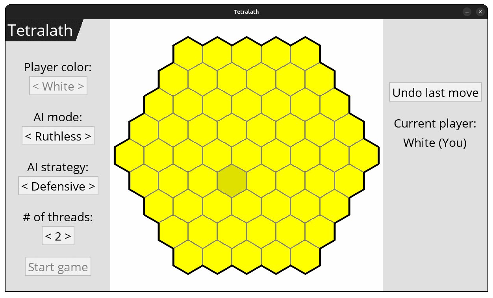
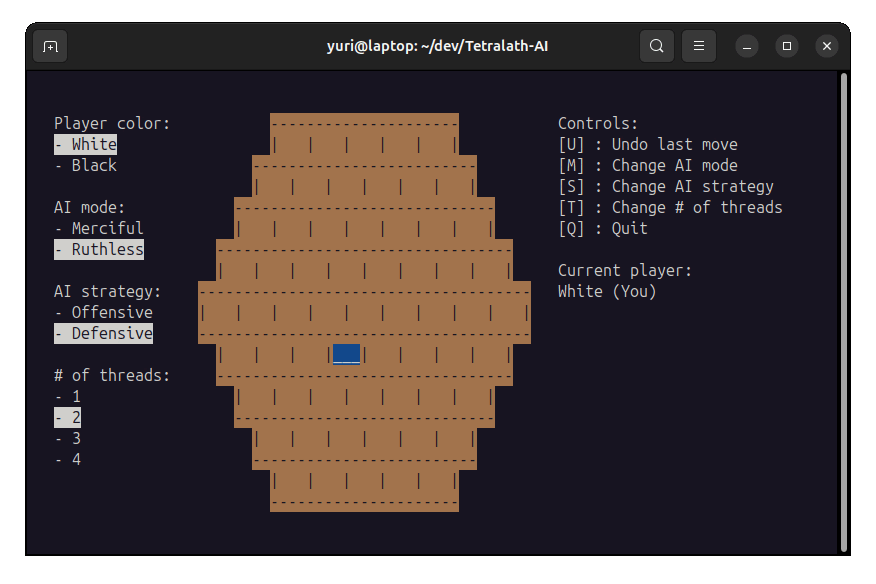

# Tetralath AI

Tetralath is a two-player turn-based board game played on a hexagonal board of 61 positions. This project lets you play against an AI that uses minimax search with alpha-beta pruning, iterative deepening and multi-threading. You can run it as a graphical (GUI) application or as a terminal (TUI) application.

---

## How to play

- **Pieces:** Two colors, white and black. You choose your color. The AI uses the other.
- **Turns:** Players alternate every turn. On your turn, you place one piece of your color on any empty cell.
- **Start:** White always make the first move to start the game.
- **Winning:** You win by forming a line of 4 pieces of your color (horizontal or along a diagonal).
- **Losing:** If you form a line of 3 pieces of your color, you lose (your opponent wins).
- **Summary:** 4-in-a-row wins. 3-in-a-row alone loses.
- **Clarification:** A line of 3 pieces that is part of a line of 4 pieces does not count as a losing scenario.
- **Draw:** If all 61 positions are filled and neither player has won or lost, the game is a tie.

---

## How to run

### Graphical version (GUI)

From the project root:

```shell
$ sudo apt update
$ sudo apt install -y build-essential python3-dev python3-pip python3-venv
$ bash ./run_frontend.sh
```

This builds the shared library in `backend/` (`libtetralath.so`), sets up a Python virtual environment in `frontend/.venv`, installs dependencies from `frontend/requirements.txt`, and runs the GUI. The game engine and AI run in the shared library.



### Terminal version (TUI)

From the project root:

```shell
$ sudo apt update
$ sudo apt install -y build-essential libncurses-dev
$ bash ./run_backend.sh
```

This builds the standalone application and runs the TUI.



---

## Why two different languages?

- **C:** In a project with no security concerns, C's low-level nature makes it the obvious choice for eeking out every bit of performance from the AI. At first, it was a standalone application with the game engine and the terminal (TUI) interface tightly coupled. It was later refactored to decouple those components and expose a headless game engine via shared library. Makes use of pthreads for multi-threading and ncurses for the TUI.
- **Python:** Python's ease-of-use, code legibility and plethora of libraries make it a good choice for implementing a graphical interface that only manages simple interactive logic and integrates well with the headless game engine for everything else. Makes use of pygame-ce and pygame-menu-ce for the GUI.

---

## AI

At the core of the AI is a minimax algorithm with alpha-beta pruning, iterative deepening and multi-threading. It runs the minimax search with depth 1, then 2, then 3 and so on until it reaches the processing time limit. Between those searches with increasing depth, it sorts the possible moves from best to worst (based on the previous run), which greatly improves the amount of pruning done and, thus, makes the next search perform much better. It also implements multi-threading so that we can evaluate multiple possible moves at the same time while also doing the best effort to make the threads efficiently divide up their work among them and to keep an updated alpha value during the search.

It also implements two sets of settings "AI mode" and "AI strategy" which are described below.

### AI modes

- **Merciful:** This mode searches for the fastest winning scenario (the one that requires the least amount of moves) in its horizon. That means that, when it has victory in sight, it proceeds to do the moves to win the game at the earliest opportunity. It's considered "merciful" because it doesn't fool around and it finishes the opponent as soon as possible. This search for the best winning scenario has a cost, though, and it makes the AI perform worse than the alternative (the "ruthless" mode).

- **Ruthless:** This mode searches for any winning scenario (not necessarily the one that requires the least amount of moves) in its horizon. That means that, when it has victory in sight, it proceeds to do any move that keeps it on track to winning but may not go straight for the quickest win. It's considered "ruthless" because, instead of finishing the opponent as soon as possible, it may sometimes end up doing some dummy moves and leave the opponent lingering but already sure of its coming defeat. This search for any winning scenario makes the AI perform better than the alternative (the "merciful" mode) because it ends up being able to prune more branches in the minimax algorithm.

### AI strategies

- **Offensive:** This strategy prioritizes moves that increase the likelihood of forming lines of 4 pieces, but that can leave the AI vulnerable to an offensive strategy from the opponent.

- **Defensive:** This strategy prioritizes blocking the opponent from forming lines of 4 pieces as much as possible as well as to force moves from the opponent to fill the board before it has any chance of executing an offensive strategy at the beginning. But that means that the AI is unlikely to get close to forming a line of 4 pieces for itself and can end up dragging the game for longer.

---

## Undo

Both versions (GUI and TUI) let you undo moves: one undo typically removes your last move and the AI's reply. Full move history is kept, so you can undo repeatedly back to the start of the game.

---

## Project layout

- **`backend/`** - C game engine and AI. Can build the standalone application or the shared library `libtetralath.so` used by the GUI.
- **`frontend/`** - Python GUI. Uses `libtetralath.so` as the game engine.
- **`archive/v1/`** - Original C implementation from 2012. Not needed to run the current GUI or TUI.
